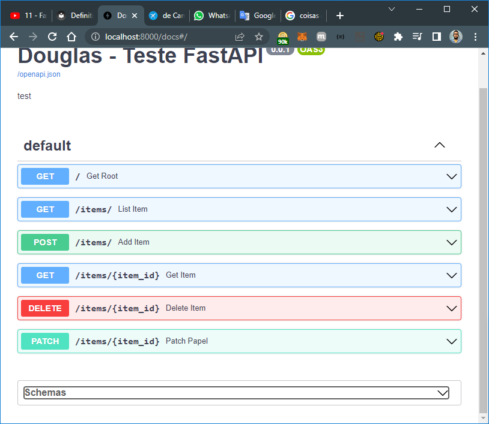

comando para executar a aplicação

$ uvicorn main:app --reload

univorn é a chamada

main é o arquivo

app é a aplicação

--reload é para refazer as alterações

ao final do GET, POST, PATCH e DELETE

chamar 

$ uvicorn main:app
